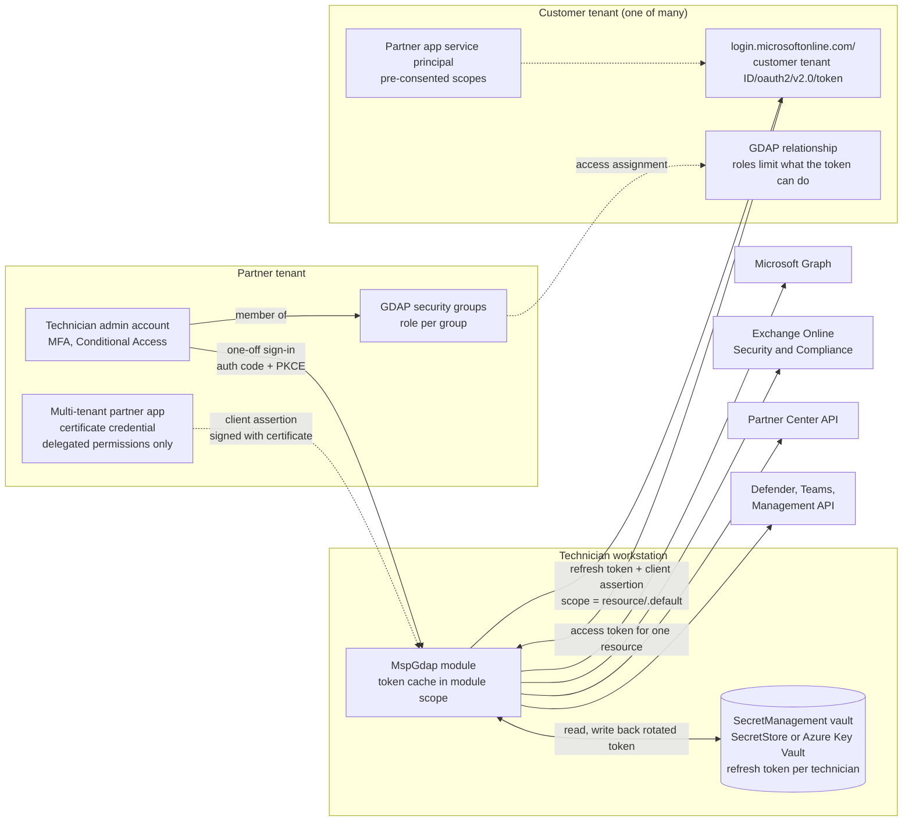

# MspGdap: GDAP partner toolkit for Microsoft partners

MspGdap is a PowerShell module and a set of guides that help a Microsoft partner (MSP or CSP) manage customer tenants through **GDAP** (granular delegated admin privileges) and the **Secure Application Model**, without storing passwords, without per-customer apps and without fetching a new token for every command.

Based on the methods GCIT ([gcit.com.au](https://gcit.com.au)) uses to manage customer tenants, generalised and hardened so that any partner can run it in their own partner tenant.

> Status: public pre-release (0.2.1). Read the [support disclaimer](#support-disclaimer) before you use it against production tenants.

## What it does

1. **Creates one multi-tenant "partner app"** in your partner tenant, with a certificate credential and a documented permission manifest (`New-MspPartnerApp`).
2. **Registers a refresh token per technician**. Each technician signs in once with their dedicated admin account (authorisation code flow with PKCE, MFA enforced by your partner tenant). The refresh token goes straight into a SecretManagement vault and is rewritten every time Microsoft rotates it (`Register-MspPartnerToken`).
3. **Pre-consents the partner app into GDAP customers** through the Partner Center `applicationconsents` API, then checks the result through Microsoft Graph (`Grant-MspPartnerAppConsent`, `Test-MspPartnerAppConsent`).
4. **Gets access tokens per customer and per resource** (Microsoft Graph, Exchange Online, Partner Center, Defender, Teams and more) from the customer's own token endpoint, caches them in module scope and validates them before reuse (`Get-MspAccessToken`, `Test-MspAccessToken`).
5. **Connects the Microsoft PowerShell modules** with those tokens (`Connect-MspExchangeOnline`, `Connect-MspGraph`, `Connect-MspTeams` and `Connect-MspSecurityCompliance`).
6. **Manages GDAP itself**: relationships, least-privilege role maps and security group assignments (`Get-MspGdapRelationship`, `New-MspGdapRelationship`, `Set-MspGdapAccessAssignment`, `Test-MspGdapAccess`).
7. **Optionally enables app-only Exchange access** for a separate unattended automation app, with real readback verification (`Enable-MspExchangeAppAccess`, `Test-MspExchangeAppAccess`).

## Tested

Tested live on 7 October 2026 against a Microsoft partner tenant and a GDAP customer: app creation, technician token registration, pre-consent, Graph, Exchange Online and Security and Compliance with delegated GDAP tokens, and four rewritten scripts.

## Who it is for

- Microsoft partners with GDAP relationships who script against customer tenants in PowerShell.
- Partners still running scripts built on DAP, MSOnline (`Connect-MsolService`), the AzureAD module, Azure AD Graph or stored admin passwords, who need a supported replacement. See [docs/07-migrating-from-dap-msonline.md](docs/07-migrating-from-dap-msonline.md).
- Security and compliance owners who want the delegated access path to be auditable, least privilege and free of shared secrets.

It is not a remote monitoring and management (RMM) platform, a PSA integration or a replacement for Microsoft 365 Lighthouse. It is the authentication and access layer those tools (and your own scripts) can sit on.

## How it works



Key points:

- **One app, one refresh token per technician.** A Microsoft Entra refresh token is bound to the user and the client, not to a resource or a tenant. The same token is redeemed at each customer's token endpoint for each resource you need.
- **The refresh token alone is not enough.** The partner app is a confidential client, so every redemption also needs the app's certificate (a signed client assertion). A refresh token copied off a disk is useless without the private key.
- **GDAP is the ceiling.** The app's consented scopes set the maximum, and the technician's GDAP roles in that customer decide what actually works. A Helpdesk Administrator stays a Helpdesk Administrator, whatever the manifest says.
- **No standing access in customer tenants.** Nothing is created in a customer except the partner app's service principal and its delegated consent, plus (only if you opt in) the separate automation app.

## Requirements

| Item | Requirement |
| --- | --- |
| PowerShell | **PowerShell 7.4 or later only.** 7.6 LTS is recommended (supported until 14 November 2028), because 7.4 and 7.5 reach end of support on 10 November 2026. Windows PowerShell 5.1 is not supported, see [Windows PowerShell 5.1](#windows-powershell-51). |
| Partner | Microsoft partner with Partner Center access, active GDAP relationships with the customers you manage, and the AdminAgents group for Partner Center API calls. |
| Technicians | A dedicated admin account per technician in the partner tenant, with MFA, in the right GDAP security groups. See [docs/01-prerequisites.md](docs/01-prerequisites.md). |
| Secret storage | `Microsoft.PowerShell.SecretManagement` 1.1.2 plus one vault: `Microsoft.PowerShell.SecretStore` (local) or `Az.KeyVault` (Azure Key Vault). |
| Optional | `ExchangeOnlineManagement` 3.1.0 or later for `Connect-MspExchangeOnline` (3.10.0 and later need PowerShell 7.6, stay on 3.9.2 or earlier on 7.4 and 7.5). `Microsoft.Graph.Authentication` for `Connect-MspGraph`. `MicrosoftTeams` for `Connect-MspTeams`. |

There are no other dependencies. All token work is plain REST against the Microsoft identity platform v2.0 endpoints.

## Quick start

The full walkthrough is in [docs/](docs/). This is the short version, run from a clone of this repository. Placeholders such as `<PartnerTenantId>` are yours to replace. Never paste real secrets into scripts.

```powershell
# 0. Prerequisites (once per workstation)
Install-Module -Name Microsoft.PowerShell.SecretManagement, Microsoft.PowerShell.SecretStore -Repository PSGallery -Scope CurrentUser
Register-SecretVault -Name 'MspGdap' -ModuleName 'Microsoft.PowerShell.SecretStore'
Import-Module ./src/MspGdap/MspGdap.psd1

# 1. Once per partner: create the partner app in YOUR partner tenant (preview first).
#    No MspGdap token exists yet, so this step uses a Microsoft Graph PowerShell session in the partner tenant.
#    -RestrictToGroupId limits sign-in to the app to your technicians' security group (recommended).
Install-Module -Name Microsoft.Graph.Authentication -Repository PSGallery -Scope CurrentUser
Connect-MgGraph -TenantId '<PartnerTenantId>' -Scopes 'Application.ReadWrite.All', 'DelegatedPermissionGrant.ReadWrite.All', 'AppRoleAssignment.ReadWrite.All'
$appParams = @{
    DisplayName           = 'Contoso MSP Worker'
    PartnerTenantId       = '<PartnerTenantId>'
    ManifestPath          = './manifests/partner-app.minimal.json'
    CertificateThumbprint = '<Thumbprint>'
    RestrictToGroupId     = '<TechnicianGroupObjectId>'
}
New-MspPartnerApp @appParams -WhatIf
New-MspPartnerApp @appParams
Disconnect-MgGraph

# 2. Once per workstation: tell the module which app, certificate and vault to use
Set-MspConfiguration -PartnerTenantId '<PartnerTenantId>' -AppId '<PartnerAppId>' -CertificateThumbprint '<Thumbprint>' -VaultName 'MspGdap'

# 3. Once per technician (and again if the token is revoked or idle for 90 days)
Register-MspPartnerToken -UserPrincipalName 'jane.admin@contoso-msp.onmicrosoft.com' -SetAsDefault

# 4. Once per customer: pre-consent the partner app, then verify
Grant-MspPartnerAppConsent -TenantId 'fabrikam.onmicrosoft.com' -ManifestPath ./manifests/partner-app.minimal.json -WhatIf
Grant-MspPartnerAppConsent -TenantId 'fabrikam.onmicrosoft.com' -ManifestPath ./manifests/partner-app.minimal.json
Test-MspPartnerAppConsent -TenantId 'fabrikam.onmicrosoft.com' -ManifestPath ./manifests/partner-app.minimal.json

# 5. Every day: work in a customer tenant
Invoke-MspGraphRequest -TenantId 'fabrikam.onmicrosoft.com' -Method GET -Uri 'v1.0/organization'
Connect-MspExchangeOnline -TenantId 'fabrikam.onmicrosoft.com'
Get-Mailbox -ResultSize 10
Disconnect-Msp
```

`-TenantId` is mandatory on every tenant-scoped command and accepts a tenant ID (GUID) or a verified domain. The module never falls back to your partner tenant. To act on the partner tenant you must say so with `-PartnerTenant`, and commands that only make sense in a customer (consent, Exchange, GDAP and the `Connect-Msp*` commands) refuse your partner tenant outright.

## Command overview

| Area | Commands |
| --- | --- |
| Configuration | `Set-MspConfiguration`, `Get-MspConfiguration` |
| Technician token | `Register-MspPartnerToken`, `Unregister-MspPartnerToken` |
| Access tokens | `Get-MspAccessToken`, `Get-MspAuthHeader`, `Test-MspAccessToken`, `Clear-MspTokenCache`, `Disconnect-Msp` |
| Requests | `Invoke-MspGraphRequest` (paging, or the first page only with `-NoPaging`, throttling with `Retry-After`, `-WhatIf` on writes), `Invoke-MspGraphBatch` (JSON batching, 20 requests per batch) |
| Customers | `Get-MspCustomer`, `Resolve-MspTenantId` |
| Partner app | `New-MspPartnerApp`, `Add-MspPartnerAppCertificate` |
| Consent | `Grant-MspPartnerAppConsent`, `Test-MspPartnerAppConsent`, `Remove-MspPartnerAppConsent` |
| GDAP | `Get-MspGdapRelationship`, `New-MspGdapRelationship`, `Set-MspGdapAccessAssignment`, `Test-MspGdapAccess` |
| Exchange app-only | `Enable-MspExchangeAppAccess`, `Test-MspExchangeAppAccess` |
| Module connections | `Connect-MspExchangeOnline`, `Connect-MspSecurityCompliance`, `Connect-MspGraph`, `Connect-MspTeams` |

Every command that changes something supports `-WhatIf` and `-Confirm`. Write and test commands such as `Grant-MspPartnerAppConsent` and `Test-MspPartnerAppConsent` return one result object per tenant with `Success`, `Outcome` and a `Steps` list. Each step has a `Status` of `Passed`, `Changed` (made and confirmed by readback), `WhatIf`, `Skipped`, `Warning`, `Failed` or `Unknown`, and `Success` is never true when any step is `Failed` or `Unknown`. Write commands (`New-MspPartnerApp`, `Add-MspPartnerAppCertificate`, `Grant-MspPartnerAppConsent`, `Remove-MspPartnerAppConsent`, `New-MspGdapRelationship`, `Set-MspGdapAccessAssignment`, `Enable-MspExchangeAppAccess`) also write a non-terminating error when the outcome is `Failed`, so `-ErrorAction Stop` and `try`/`catch` work in automation. `Test-*` commands return `Success = $false` without an error. Use `Get-Help <command> -Full` for parameters and examples.

## Guides

| Guide | Covers |
| --- | --- |
| [01 Prerequisites](docs/01-prerequisites.md) | Partner Center, GDAP relationships and security groups, least-privilege role map, dedicated admin accounts, MFA, Conditional Access |
| [02 Create the partner app](docs/02-create-partner-app.md) | `New-MspPartnerApp`, the manual Microsoft Entra admin center steps, certificates, minimal or full manifest, admin consent |
| [03 Register a technician token](docs/03-register-technician-token.md) | Vault options, Key Vault RBAC, rotation, revocation, offboarding a technician |
| [04 Pre-consent customers](docs/04-preconsent-customers.md) | `Grant-MspPartnerAppConsent`, required GDAP roles, AADSTS65001, checking and removing consent |
| [05 Exchange access](docs/05-exchange-access.md) | Delegated Exchange Online, app-only automation, roles, Security and Compliance |
| [06 Token caching and validation](docs/06-token-caching-and-validation.md) | How the cache works, validation rules, what is never logged, common pitfalls in older Secure Application Model scripts |
| [07 Migrating from DAP and MSOnline](docs/07-migrating-from-dap-msonline.md) | Retired patterns and their replacements, with code |
| [08 Unattended automation](docs/08-unattended-automation.md) | Azure Functions and Azure Automation with managed identity and Key Vault |
| [manifests/README.md](manifests/README.md) | Every permission in the manifests and why it is there |
| [scripts/README.md](scripts/README.md) | Working GDAP rewrites of retired MSOnline, DAP and stored-password partner scripts, mapped to the original articles |

## Threat model

This section lists what the toolkit protects, what it assumes and what it does not try to solve. Report weaknesses through [SECURITY.md](SECURITY.md).

### Assets

| Asset | Where it lives | Why it matters |
| --- | --- | --- |
| Partner app private key | Certificate store (non-exportable key) or Azure Key Vault | With a refresh token, it mints customer tokens |
| Technician refresh tokens | SecretManagement vault only | Valid for 90 days and rotated on use. Reach every customer the technician's GDAP roles cover |
| Access tokens | Module-scoped memory cache, 60 to 90 minutes | Bearer tokens for one resource in one tenant |
| GDAP role assignments | Partner Center and customer tenants | The real limit on what any token can do |
| Automation app credential (optional) | Azure Key Vault or the automation host's certificate store | App-only access, not limited by GDAP |

### Threats and mitigations

| Threat | Mitigation in MspGdap | What you must do |
| --- | --- | --- |
| Refresh token theft from disk, logs or a shared vault | Stored only through SecretManagement as a `SecureString`. Never in `$global:`, never written to plain-text files, never in verbose or debug output. Secret names use a hash of the UPN, not the UPN | Use a vault per technician, or Key Vault RBAC that limits each technician to their own secret. Never share a vault access key or function key |
| Stolen refresh token used elsewhere | Redemption needs the partner app's private key (confidential client) | Keep the key non-exportable. Monitor the partner app's sign-in logs |
| Partner app certificate theft | Certificate preferred over secrets. The module never exports the private key | Short certificate lifetime (12 months or less), rotation with `Add-MspPartnerAppCertificate`, alerting on credential changes to the app |
| Over-privileged access | Least-privilege default role map. Global Administrator is never in the default map. Delegated permissions only on the partner app | Map roles per security group and per job. Review Default GDAP relationships created by Microsoft |
| Wrong-tenant change | `-TenantId` is mandatory and validated against the token's tenant. No fallback to the partner tenant, and customer-only commands refuse the partner tenant | Use `-WhatIf` before writes. Read the target tenant name in results |
| Phished technician sign-in | Authorisation code flow with PKCE in the system browser. Device code flow is not used. The loopback listener ignores requests that do not come from this computer, and a token is only stored when the id_token nonce matches and the claims show MFA | Conditional Access for admin accounts: phishing-resistant MFA, compliant device, sign-in frequency |
| Token replay | Access tokens are short lived and cached in memory only. `Disconnect-Msp` clears the cache and closes the Exchange, Security and Compliance, Graph SDK and Teams sessions MspGdap opened | Close sessions when you finish. Do not copy tokens into other tools |
| Partner Center calls without MFA | Partner Center requests send `ValidateMfa: true` and surface `isMfaCompliant` | Register tokens from an MFA sign-in (enforced by Partner Center since 1 April 2026) |
| Silent failure reported as success | Write and test commands read back every change and return per-step status. Failed writes also raise an error | Treat any `Failed` or `Unknown` step as a failure in your own scripts |
| Over-privileged automation app | `Enable-MspExchangeAppAccess` only grants roles Exchange app-only supports, needs a switch for anything beyond Exchange, and refuses apps that are not registered in your partner tenant | Keep the automation app separate from the partner app, and review its role assignments quarterly |
| Duplicate writes after a timeout | POST and PATCH requests are not retried on 503 or 504, and Partner Center calls carry one `ms-requestid` across retries | Check results before re-running a failed write |
| Supply chain | No third-party runtime dependencies. CI runs PSScriptAnalyzer, Pester and gitleaks | Pin a released version. Review changes before you upgrade |

### Out of scope

- A technician workstation that is already compromised while a session is unlocked. An attacker with code execution as the technician can use the cached tokens and the unlocked vault, the same as with any admin tool.
- Abuse by a technician acting within their assigned GDAP roles. Use GDAP role design, Microsoft Entra Privileged Identity Management for groups and audit logs for this.
- Customer-side controls such as customer Conditional Access policies that apply to partner users.

## Windows PowerShell 5.1

Windows PowerShell 5.1 is not supported, and the module will not load in it. The manifest requires PowerShell 7.4 (Core edition), and the code uses .NET 5 and PowerShell 7 features such as `[Convert]::ToHexString`, `SHA256.HashData`, `RandomNumberGenerator.GetBytes(int)`, `Join-Path -AdditionalChildPath` and `$IsWindows`. Install PowerShell 7 side by side with Windows PowerShell. It does not replace it.

## Credit

Based on the methods GCIT ([gcit.com.au](https://gcit.com.au)) uses to manage customer tenants. GCIT is a Microsoft partner and managed service provider on the Gold Coast, Australia. This repository is a clean, generic rewrite: it contains no GCIT tenant, app, customer or secret identifiers.

## Support disclaimer

This project is provided under the [MIT licence](LICENSE), as is, without warranty of any kind. It is not a Microsoft product and is not supported by Microsoft. GCIT does not provide support for it under any customer agreement. Issues and pull requests are welcome, but there is no guaranteed response time.

You are responsible for what you run against your partner tenant and your customers' tenants. Test in a sandbox or low-risk customer first, use `-WhatIf`, and make sure your GDAP roles and your customer agreements allow the changes you make. Microsoft changes these APIs and their requirements regularly. Check the linked Microsoft Learn pages in each guide before relying on a detail.

## Licence

[MIT](LICENSE). Copyright (c) 2026 GCIT Pty Ltd.
