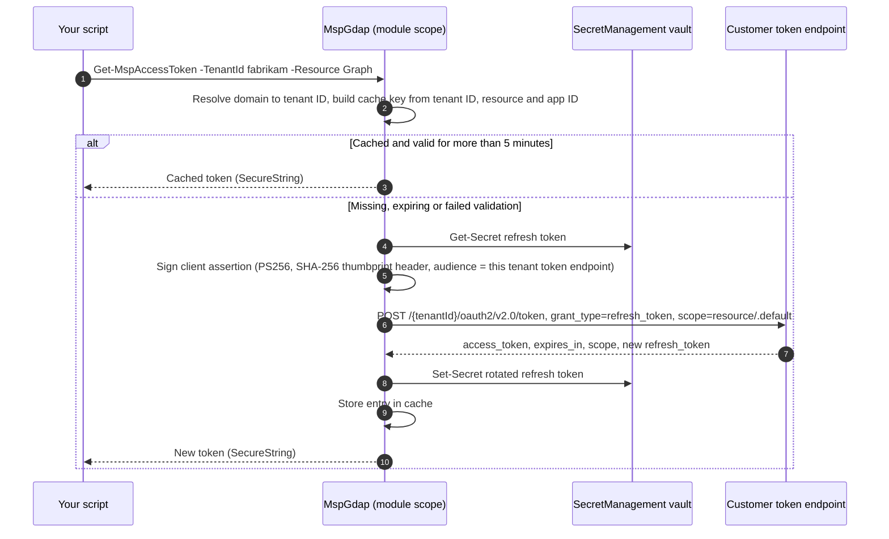

# 06 Token caching and validation

MspGdap gets an access token per customer tenant and per resource, keeps it in memory while it is valid and checks it before every reuse. This guide explains how the cache avoids constant refreshes, what "valid" means, and what the module never logs.

## Why a cache matters

An access token from the Microsoft identity platform lasts between 60 and 90 minutes (75 on average). A script that asks for a new token before every request is slow, adds load on the token endpoint and rotates the refresh token far more often than needed. A script that keeps one global token is worse: it reuses a token for the wrong tenant or resource, or keeps using it after it has expired.

MspGdap's rule is simple: **one cached token per tenant, resource and app, reused until five minutes before it expires.**

## How it works



Details:

- **Cache location.** A private hashtable in the module's script scope. It is not exported, not in `$global:` and not written to disk. It disappears when the PowerShell session ends or the module is removed.
- **Cache key.** `<tenantId>|<resource>|<appId>`, with the tenant always resolved to its GUID first, so `fabrikam.onmicrosoft.com` and its tenant ID share one entry.
- **Cache entry.** The access token as a `SecureString`, the expiry time calculated from `expires_in` when the response arrived, the tenant ID and resource that were **requested**, the `scope` string returned, and (if the token can be decoded) a few claims for extra checks.
- **Token request.** The v2.0 endpoint of the customer's own tenant (`https://login.microsoftonline.com/<customer tenant ID>/oauth2/v2.0/token`), with `scope=<resource>/.default`. Microsoft requires scopes from a single resource per request, which is why each resource gets its own token.
- **Client assertion.** A JWT signed with the partner app's certificate, `aud` set to the token endpoint of the tenant being called, a unique `jti` and a lifetime of five minutes.
- **Rotation.** Every response carries a new refresh token, which is written back to the vault before the access token is returned. See [03 Register a technician token](03-register-technician-token.md#rotation).
- **Partner tenant.** Tokens for your own tenant (Partner Center, GDAP management) work the same way but need `-PartnerTenant` instead of `-TenantId`. There is no silent default.

### Parallel work

PowerShell runspaces don't share module state. `ForEach-Object -Parallel` and `Start-ThreadJob` each start with an empty cache and redeem their own tokens. That is safe (each redemption returns a valid rotated refresh token and the previous token stays valid until it expires), but it costs extra token requests. For large customer loops, process each customer sequentially within one runspace, or give each runspace its own block of customers.

## Validation rules

`Test-MspAccessToken` runs before every reuse, and you can call it yourself on the output of `Get-MspAccessToken`. It takes the tenant as a GUID, so resolve a domain first:

```powershell
$tenantId = Resolve-MspTenantId -Tenant 'fabrikam.onmicrosoft.com'
$token = Get-MspAccessToken -TenantId $tenantId -Resource Graph
$token | Test-MspAccessToken -TenantId $tenantId -Resource Graph
$token | Test-MspAccessToken -TenantId $tenantId -Resource Graph -RequiredScope 'User.Read.All' -Detailed
```

With `-Detailed` you get `IsValid` and a list of `Reasons` instead of `$true` or `$false`.

### Primary checks (always)

These use the data returned with the token, which Microsoft says is the right source for clients.

| Check | Rule |
| --- | --- |
| Present | An entry exists for the key built from tenant ID, resource and app ID |
| Not expiring | Expiry is more than **5 minutes** in the future (clock skew buffer) |
| Tenant | The tenant the token was requested for equals the tenant you asked about |
| Resource | The resource the token was requested for equals the resource you asked about |
| Scope (optional) | Every value in `-RequiredScope` appears in the returned `scope` string |

### Extra checks (best effort)

Microsoft states that clients should treat access tokens as opaque: "Tokens that a Microsoft API receives might not always be a JWT that can be decoded", and Microsoft Graph tokens use a proprietary format. So MspGdap decodes the token payload only if it can, and never fails a token just because it can't be decoded.

| Claim | Rule when the token can be decoded |
| --- | --- |
| `exp` | More than 5 minutes in the future |
| `tid` | Equals the requested tenant ID |
| `aud` | Matches the resource in either URI form (`https://graph.microsoft.com`, with or without a trailing slash) or app ID form (`00000003-0000-0000-c000-000000000000`) |
| `scp` or `roles` | Contains every value in `-RequiredScope` |

If any check fails, the entry is removed and `Get-MspAccessToken` fetches a new token. MspGdap never validates token signatures. That is the resource API's job, and Microsoft says clients can't validate Graph tokens.

### Why five minutes

Five minutes is under 10 per cent of the shortest normal token lifetime. It covers clock drift between your machine and Microsoft, and a long-running request that starts just before expiry. Tokens issued with continuous access evaluation can last 20 to 28 hours and work the same way.

## Resources

Pass the resource as an alias (`Graph`, `Exchange`, `PartnerCenter`, `ManagementApi`, `Defender`, `AzureManagement`, `TeamsAdmin`), its URI or its application ID. MspGdap requests `<resource>/.default` unless you ask for specific scopes with `-Scope`.

| Service | Resource | Tenant |
| --- | --- | --- |
| Microsoft Graph | `https://graph.microsoft.com` | Customer (`-TenantId`) or partner (`-PartnerTenant`) |
| Exchange Online and Security and Compliance | `https://outlook.office365.com` | Customer |
| Partner Center | `https://api.partnercenter.microsoft.com` | Partner (`-PartnerTenant`) |
| Office 365 Management API | `https://manage.office.com` | Customer |
| Microsoft Defender for Endpoint | `fc780465-2017-40d4-a0c5-307022471b92` | Customer |
| Skype and Teams Tenant Admin API | `48ac35b8-9aa8-4d74-927d-1f4a14a0b239` | Customer |
| SharePoint Online | `https://<tenant>-admin.sharepoint.com` | Customer |
| Azure Resource Manager | `https://management.azure.com` | Customer (needs Azure RBAC as well as GDAP, and an MFA-sourced token) |

Each resource must be in your manifest and consented in the customer. Otherwise the request fails with `AADSTS65001`. See [04 Pre-consent customers](04-preconsent-customers.md#troubleshooting).

## Using tokens in your own scripts

Prefer the module's own commands, which keep the token inside the module:

```powershell
Invoke-MspGraphRequest -TenantId 'fabrikam.onmicrosoft.com' -Method GET -Uri 'v1.0/users?$select=id,userPrincipalName'
```

When you need to call an API MspGdap doesn't wrap, use `Get-MspAuthHeader`. It returns a header hashtable for `Invoke-RestMethod`. The header has to contain the bearer token in plain text for the HTTP call, so keep it in a local variable, never print it and never pass it to logging.

```powershell
$headers = Get-MspAuthHeader -TenantId 'fabrikam.onmicrosoft.com' -Resource 'https://manage.office.com'
Invoke-RestMethod -Method GET -Uri 'https://manage.office.com/api/v1.0/<customer tenant ID>/activity/feed/subscriptions/list' -Headers $headers
Remove-Variable -Name headers
```

To clear tokens:

```powershell
Clear-MspTokenCache -TenantId 'fabrikam.onmicrosoft.com'   # one customer
Clear-MspTokenCache                                       # everything
Disconnect-Msp                                            # cache and all other session state
```

## What is never logged

| Item | Never appears in |
| --- | --- |
| Access tokens | Console output, verbose, debug, information or warning streams, error messages, transcripts the module writes, files |
| Refresh tokens | Same as above. Only ever passed to `Set-Secret` and `login.microsoftonline.com` |
| Client assertions, authorisation codes, PKCE verifiers | Same as above |
| Certificate private keys and client secrets | Same as above. Private keys are never exported |

What verbose output **does** show, to help you troubleshoot: the tenant ID, the resource, whether the cache was hit or missed, the token's expiry time, the token endpoint host, and the request and correlation IDs Microsoft returns. Errors include the AADSTS code, its description, the trace ID and the correlation ID, not the request body.

If you run `Start-Transcript`, remember that anything **your** script prints is captured. Don't print headers or token objects.

## Common pitfalls in older Secure Application Model scripts

Many partner scripts written for DAP and the first Secure Application Model guidance share the same weak spots. MspGdap is designed to avoid them. Use this table to review your own older scripts.

| Area | Common pitfall | MspGdap |
| --- | --- | --- |
| Where tokens live | Global variables, one slot per resource | Private module-scoped cache, keyed by tenant, resource and app |
| Switching customers | One slot per resource, so switching back and forth fetches new tokens each time | Every tenant keeps its own entry until expiry |
| Expiry check | No safety buffer, so a token can expire mid-request | Five-minute buffer everywhere |
| Audience check | Not checked | Requested resource always checked, `aud` checked when decodable, URI and GUID forms accepted |
| Tenant check | Only checked when the token decodes | Requested tenant always checked, `tid` checked when decodable |
| Opaque tokens | Every token assumed to be a decodable JWT | Treated as opaque, decoding is best effort only |
| Token endpoint | The v1.0 endpoint (`resource=`) | v2.0 endpoint everywhere (`scope=<resource>/.default`) |
| Apps and refresh tokens | Separate apps and refresh tokens per resource family | One app and one refresh token per technician, redeemed for any resource |
| Rotated refresh tokens | Discarded | Written back to the vault on every redemption |
| Missing tenant | An empty tenant value silently falls back to the partner tenant | `-TenantId` is mandatory. `-PartnerTenant` must be explicit, and customer-only commands refuse the partner tenant |
| Errors | Failures swallowed, or reported as success | Errors surface with AADSTS code and correlation ID, and failed write commands raise an error as well as returning `Success = $false` |
| Client assertion | RS256 with `x5t` | PS256 with `x5t#S256` (RS256 fallback) |

## Microsoft Learn references

- [Access tokens in the Microsoft identity platform](https://learn.microsoft.com/en-us/entra/identity-platform/access-tokens)
- [Refresh tokens in the Microsoft identity platform](https://learn.microsoft.com/en-us/entra/identity-platform/refresh-tokens)
- [Certificate credentials](https://learn.microsoft.com/en-us/entra/identity-platform/certificate-credentials)
- [Authorisation code flow](https://learn.microsoft.com/en-us/entra/identity-platform/v2-oauth2-auth-code-flow)
- [Microsoft Graph throttling guidance](https://learn.microsoft.com/en-us/graph/throttling)
- [Secure Application Model framework](https://learn.microsoft.com/en-us/partner-center/developer/secure-app-model-framework)
